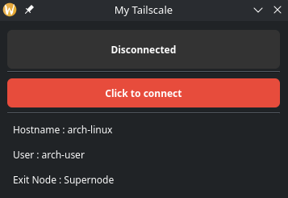

# My Tailscale

The **minimal** Tailscale widget for Linux.



Focused around the following:

* Bring up the Tailscale connection
* Take down the Tailscale connection
* Show connection status and minimal amount of details, such as: which exit node you are connected to, name of the user, name of the client hostname

**Absolutely no feature creep is planned unless needs aren't met!**

## Goals
Connect to an exit node over port UDP 53 to create a Wireguard tunnel from the client to the exit node. Tailscale and Wireguard having their own benefits, doubles as a nice VPN tunnel once you have a connection to your own trusted exit node. 

Useful when and if you are travelling, connected to an untrusted network or simply want access to your own tail-net.

Why port 53? Many firewall admins tend to block UDP port ranges except for most commonly used ports. This is also why good VPN providers like Mullvad fall back to port 53.

## Install
Pre-requisites:
* Tailscale (yes, it's true)
* python
* python QT
* python uv


**Install Tailscale**

At the least, you want to have one 'always on' exit node. Install Tailscale there and set that node as exit node.
Secondly, install Tailscale on your second machine acting as a client.

Tailscale Installation notes:
[Tailscale Linux documentation](https://tailscale.com/kb/1031/install-linux)

Once tailscale is installed on an exit node of your choice, set that node as an exit node: [Tailscale exit-node setup](https://tailscale.com/kb/1103/exit-nodes?tab=linux)

**Install Python UV**

[Link to their docs](https://docs.astral.sh/uv/getting-started/installation/)

You can pipe their installer to shell, but please read the install script before running it!!!

```curl -LsSf https://astral.sh/uv/install.sh | sh```

Otherwise use PyPi 

```pip install uv``` or ```pipx install uv```

**Clone this project and add application icon and desktop launcher**

```
cd ~/.local/share
git clone https://github.com/a-zb/my-tailscale.git

# Sync python dependencies
cd my-tailscale
uv sync

# link the icon in the project in the main icons directory
ln -s /home/YOURUSERNAME/.local/share/my-tailscale /usr/share/icons/tailscale.png

# link the desktop launcher in the applications directory
ln -s /home/YOURUSERNAME/.local/share/my-tailscale/my-tailscale.desktop /home/YOURUSERNAME/.local/share/applications/my-tailscale.desktop

# refresh application database(optional)
update-desktop-database ~/.local/share/applications || true
```

**Configure tailscale**

```
#Edit /etc/default/tailscaled and ensure PORT=53 is present instead of the default value. Save the file.
#Restart tailscaled
sudo systemctl restart tailscaled

#Set your operator to your username to avoid use of 'sudo' down the line
sudo tailscale set --operator=$USER

#Set your desired exit node. I'll assume you have a node with hostname 'Supernode'
sudo tailscale set --exit-node=Supernode
```

**Run the widget**

Use your application menu. This is tested on KDE(CachyOS, Arch based distros) and Gnome(Debian)

Otherwise, use the terminal:
```
cd ~/.local/share/my-tailscale
uv run main.py
```